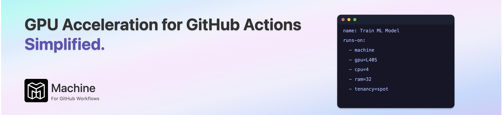

[](https://machine.dev/)

Machine supercharges your GitHub Workflows with seamless GPU acceleration. Say goodbye to the tedious overhead of managing GPU runners and hello to streamlined efficiency. With Machine, developers and organizations can effortlessly scale their AI and machine learning projects, shifting focus from infrastructure headaches to innovation and speed.


# Supervised Fine-Tuning (SFT)

This repository provides a complete, automated workflow for GPU-accelerated supervised fine-tuning (SFT) of Llama 3.2 models using Unsloth. Leveraging GitHub Actions powered by Machine.dev, it simplifies fine-tuning conversational models using popular datasets such as FineTome-100k and OpenAssistant's oasst1, optimizing models through LoRA (Low-Rank Adaptation).

We have followed the guides provided by unsloth from their [Notebook](https://colab.research.google.com/github/unslothai/notebooks/blob/main/nb/Llama3.2_(1B_and_3B)-Conversational.ipynb)

> **ℹ️ Info:** The code in this repo was taken from the unsloth repository and is used
for the training process. The code is a great resource for understanding the training
process and the techniques used to fine-tune the model.

---

### ✨ **Key Features**

- **⚡ GPU Acceleration:** Efficiently fine-tune conversational models using GPUs via [Machine](https://machine.dev)
- **🗣️ Conversational Models:** Quickly fine-tune Llama 3.2 for conversational tasks
- **📚 Popular Datasets:** Easily train on widely-used datasets such as FineTome-100k and oasst1
- **🚀 LoRA Optimizations:** Utilize Low-Rank Adaptation (LoRA) for memory-efficient training
- **📤 Hugging Face Hub:** Automatically push trained models directly to Hugging Face repositories
- **🛠️ Customizable Training:** Flexibly configure training parameters like LoRA rank, learning rate, and maximum sequence length
- **📈 Enhanced Inference:** Seamlessly switch from fine-tuning to optimized inference mode

---

### 📁 **Repository Structure**

```
├── .github/workflows/
│   └── supervised-fine-tuning.yaml     # Workflow for supervised fine-tuning
├── supervised_fine_tuning.py           # Script for fine-tuning and inference
└── requirements.txt                    # Python dependencies
```

---

### ▶️ **Getting Started**

#### 1. **Use This Repository as a Template**
Click the **Use this template** button at the top of this page to create your own copy.

#### 2. **Set Up GPU Runners**
Ensure your repository uses Machine GPU-powered runners. No additional configuration is required if you're already using Machine.dev.

#### 3. **Configure Hugging Face Access**

1. Create a Hugging Face access token with write permissions.
2. Add this token as a repository secret named `HF_TOKEN` in your GitHub repository settings.

#### 4. **Run the Workflow**

- Trigger the workflow manually in GitHub Actions (`workflow_dispatch`).
- Customize training parameters directly from GitHub Actions:

  ```yaml
  inputs:
    source_model: 'unsloth/Llama-3.2-3B-Instruct'
    data_set: 'mlabonne/FineTome-100k'
    max_seq_length: '2048'
    lora_rank: '16'
    max_steps: '100'
    learning_rate: '2e-4'
    hf_target_repo: 'your-hf-repo-name'
  ```

#### 5. **Monitor and Review Results**

- Training progress, metrics, and GPU usage statistics are logged during each workflow execution.
- The fine-tuned model is automatically pushed to the specified Hugging Face repository upon completion.
- Easily switch the saved model into optimized inference mode as demonstrated in the provided script.

---

### 🔑 **Prerequisites**

- GitHub account
- Access to [Machine](https://machine.dev) GPU-powered runners
- [Hugging Face](https://huggingface.co) account for model hosting

_No local installation necessary—all processes run directly within GitHub Actions._

---

### 📄 **License**

This repository is available under the [MIT License](LICENSE).

---

### 📌 **Notes**

- This supervised fine-tuning template specifically targets Llama 3.2 models for conversational tasks, but it can easily be adapted for other models, datasets, and tasks with minimal modifications.

- This repository is currently open for use as a template. While public forks are encouraged, we are not accepting Pull Requests at this time.

_For questions or concerns, please open an issue._

